<div align="center">


<h1>Internal Audit Bot</h1>

<p><strong>The Institutional-Grade Platform for Continuous Control Monitoring, Automated Evidence Collection, and Multi-Cloud Audit Readiness.</strong></p>

[]()
[]()
[]()

<br/>

> **"Evidence is the currency of trust."** 
> **Internal Audit Bot** is an enterprise-grade platform designed to provide a secure, measurable, and highly automated foundation for global compliance operations. It orchestrates the complex lifecycle of internal audits—from continuous control monitoring and automated multi-cloud evidence vaulting to real-time remediation orchestration and unified compliance governance.

</div>

---

## 🏛️ Executive Summary

Fragmented compliance checks and manual evidence collection processes are strategic audit liabilities; lack of centralized compliance orchestration is a primary barrier to organizational regulatory maturity. Organizations fail to maintain audit readiness not because of a lack of controls, but because of fragmented audit standards, lack of automated violation remediation, and an inability to orchestrate internal audits with operational precision.

This platform provides the **Compliance Intelligence Plane**. It implements a complete **Enterprise Audit-as-Code Framework**, enabling Audit and Compliance teams to manage global regulatory efforts as first-class citizens. By automating the identification of control failures through real-time log analysis and orchestrating the vaulting of immutable evidence, we ensure that every organizational asset—from cloud infrastructure configs to application access logs—is audited by default, verified for history, and strictly aligned with institutional compliance frameworks.

---

## 📐 Architecture Storytelling: Principal Reference Models

### 1. Principal Architecture: Global Internal Audit & Compliance Intelligence Plane
This diagram illustrates the end-to-end flow from multi-cloud log ingestion and rule evaluation to automated remediation, evidence vaulting, and institutional audit reporting.

```mermaid
graph LR
    %% Subgraph Definitions
    subgraph AuditIngress["Multi-Cloud & Log Ingress"]
        direction TB
        CloudConfigs["AWS / Azure / GCP Configs"]
        AccessLogs["SAML / OIDC Access Logs"]
        AppStates["Kubernetes / DB States"]
    end

    subgraph IntelligenceEngine["Compliance Intelligence Hub"]
        direction TB
        API["FastAPI Audit Gateway"]
        RuleEngine["Policy-as-Code Rule Hub"]
        EvidenceVault["Immutable Evidence Vault"]
        RemediationOrch["Remediation Orchestrator"]
    end

    subgraph EnforcementPlane["Distributed Audit Fleet"]
        direction TB
        AuditWorkers["Continuous Control Scanners"]
        EvidenceCollectors["Automated Evidence Gatherers"]
        AuditProxies["Compliance Validation Proxies"]
    end

    subgraph OperationsHub["Institutional Audit Hub"]
        direction TB
        Scorecard["Compliance Maturity Score"]
        Analytics["Violation & Audit Stats"]
        Audit["Forensic Compliance Metadata Lake"]
    end

    subgraph DevOps["Audit-as-Code Framework"]
        direction TB
        TF["Terraform Audit Modules"]
        DriftBot["Compliance Drift Validator"]
        ChatOps["Remediation Approval Hub"]
    end

    %% Flow Arrows
    AuditIngress -->|1. Submit Audit Data| API
    API -->|2. Evaluate Rules| RuleEngine
    RuleEngine -->|3. Identify Violation| RemediationOrch
    RuleEngine -->|4. Vault Evidence| EvidenceVault
    
    RemediationOrch -->|5. Execute Remediation| EnforcementPlane
    EnforcementPlane -->|6. Notify Violation| ChatOps
    API -->|7. Visualize Readiness| Scorecard
    
    Scorecard -->|8. Track Drift| Analytics
    Scorecard -->|9. Record Findings| Audit
    
    TF -->|10. Provision Hub| IntelligenceEngine
    DriftBot -->|11. Inject Compliance Risk| RuleEngine
    Audit -->|12. Improve Controls| RemediationOrch

    %% Styling
    classDef ingress fill:#f5f5f5,stroke:#616161,stroke-width:2px;
    classDef intel fill:#e8eaf6,stroke:#1a237e,stroke-width:2px;
    classDef enforcement fill:#e1f5fe,stroke:#01579b,stroke-width:2px;
    classDef ops fill:#ede7f6,stroke:#311b92,stroke-width:2px;
    classDef devops fill:#e8f5e9,stroke:#1b5e20,stroke-width:2px;

    class AuditIngress ingress;
    class IntelligenceEngine intel;
    class EnforcementPlane enforcement;
    class OperationsHub ops;
    class DevOps devops;
```

### 2. The Continuous Audit Lifecycle Flow
The continuous path of an audit event from initial ingestion and rule analysis to active violation flagging, automated remediation, verification, and institutional forensic auditing.

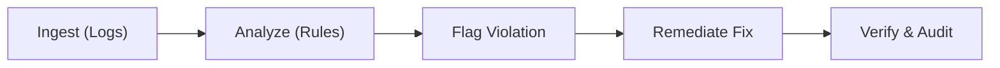

### 3. Cross-Cloud Compliance Topology
Strategically monitoring compliance across AWS, Azure, GCP, and on-premises environments, providing a unified institutional view of global regulatory health and control adherence.

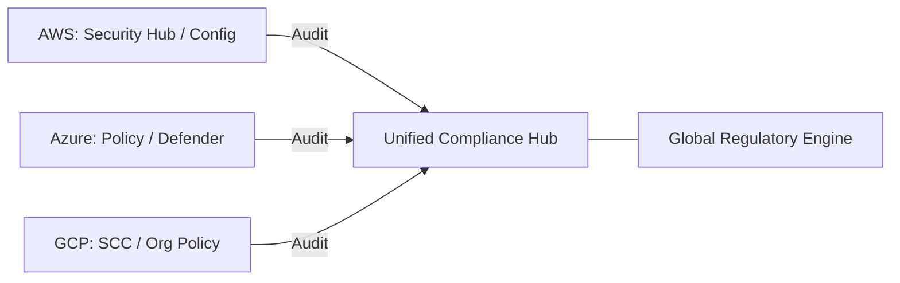

### 4. Distributed Rule Engine & Policy-as-Code Flow
Executing complex logic for evaluating multi-cloud resources against SOX, HIPAA, PCI-DSS, and institutional standards, ensuring every organizational asset is compliant by default.

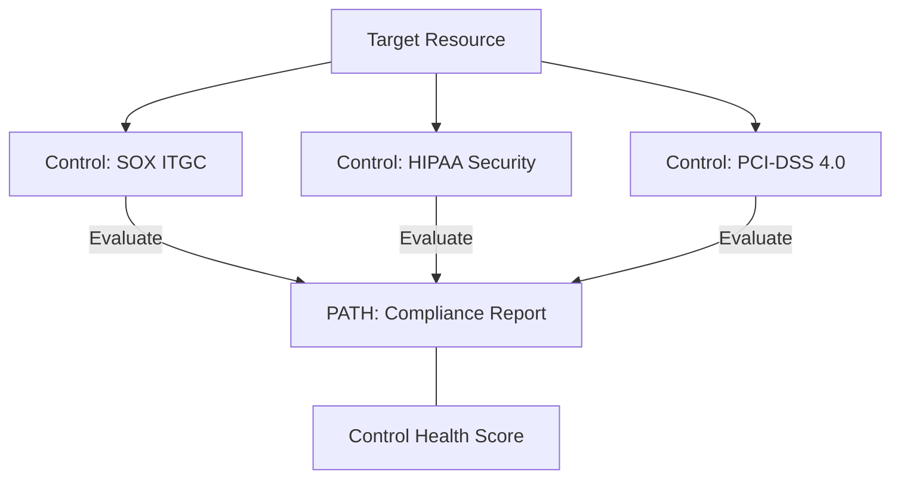

### 5. Automated Evidence Collection & Vaulting Flow
Securely gathering and storing immutable proof of compliance—including configuration snapshots and access logs—in a WORM (Write Once Read Many) vault for institutional record-keeping.

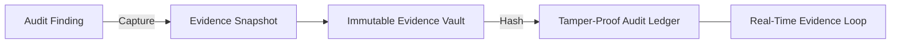

### 6. Remediation Orchestration & Approval Flow
Managing the lifecycle of a compliance violation fix, handling both automated remediations for low-risk findings and manual approval workflows for critical system changes.

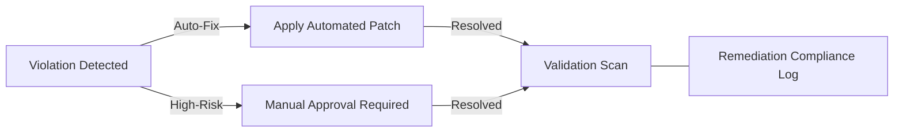

### 7. Institutional Compliance Maturity Scorecard
Grading organizational performance based on key indicators: Control Adherence Rate, Remediation Velocity, and Policy Coverage Index.

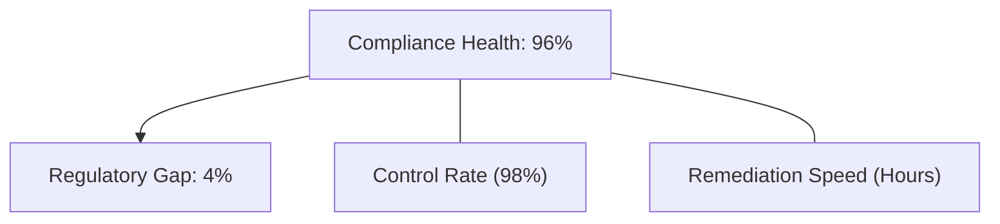

### 8. Identity & RBAC for Audit Governance
Managing fine-grained access to audit schedules, remediation triggers, and evidence vaults between Internal Auditors, Compliance Engineers, and Resource Owners.

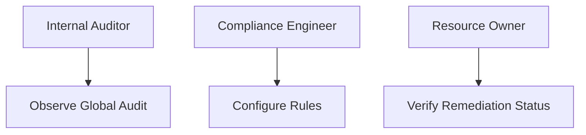

### 9. IaC Deployment: Audit-as-Code Framework
Using modular Terraform to deploy and manage the versioned distribution of the audit tracking hubs, compliance scanners, and forensic metadata lakes.

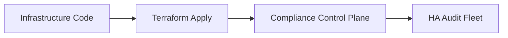

### 10. AIOps Compliance Anomaly & Drift Validation Flow
Using advanced analytics to identify sudden drops in organizational compliance, suspicious policy overrides, or unusual remediation patterns that could result in institutional risk.

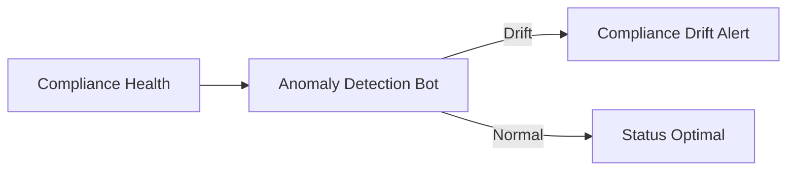

### 11. Metadata Lake for Forensic Compliance Audit
Storing long-term records of every control check, every violation flagged, and every remediation action for institutional record-keeping, compliance auditing, and post-audit forensics.

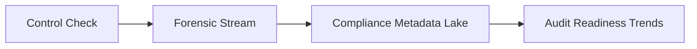

---

## 🏛️ Core Audit Pillars

1.  **Unified Compliance Coordination**: Maximizing resilience by centralizing all audit monitoring through a single institutional plane.
2.  **Automated Evidence Vaulting**: Eliminating "missing proof" scenarios through proactive and immutable evidence collection.
3.  **Sequential Remediation Intelligence**: Ensuring zero-interruption operations through dependency-aware violation fixing.
4.  **Zero-Trust Policy Protection**: Automatically enforcing policy-as-code and rule evaluation across all storage tiers.
5.  **Autonomous Audit Logic**: Guaranteeing regulatory availability through automated compliance monitoring runbooks.
6.  **Full Audit Auditability**: Immutable recording of every control test and remediation result for institutional forensics.

---

## 🛠️ Technical Stack & Implementation

### Audit Engine & APIs
*   **Framework**: Python 3.11+ / FastAPI.
*   **Rule Engine**: Managed OPA (Open Policy Agent) for complex control evaluation.
*   **Evidence Hub**: Integration with AWS Config, Azure Policy, and GCP Security Command Center.
*   **Persistence**: PostgreSQL (Audit Ledger) and Redis (Live Violation State).
*   **Auth Orchestrator**: Federated OIDC/SAML for least-privilege audit management access.

### Audit Dashboard (UI)
*   **Framework**: React 18 / Vite.
*   **Theme**: Dark, Blue, Amber (Modern high-fidelity audit aesthetic).
*   **Visualization**: D3.js for compliance topologies and Recharts for remediation velocity analytics.

### Infrastructure & DevOps
*   **Runtime**: AWS EKS or Azure Kubernetes Service (AKS) for management plane.
*   **Vault Hub**: Cross-region replicated S3/Blob storage with WORM policies.
*   **IaC**: Modular Terraform for deploying the compliance landing zone and audit fleet.

---

## 🏗️ IaC Mapping (Module Structure)

| Module | Purpose | Real Services |
| :--- | :--- | :--- |
| **`infrastructure/audit_hub`** | Central management plane | EKS, PostgreSQL, Redis |
| **`infrastructure/scanners`** | Continuous control monitoring fleet | K8s Workers, Cloud APIs |
| **`infrastructure/vaults`** | Immutable evidence storage sinks | S3, Object Lock, IAM |
| **`infrastructure/auditing`** | Forensic compliance sinks | S3, Athena, Quicksight |

---

## 🚀 Deployment Guide

### Local Principal Environment
```bash
# Clone the audit platform
git clone https://github.com/devopstrio/internal-audit-bot.git
cd internal-audit-bot

# Configure environment
cp .env.example .env

# Launch the Audit stack
make init

# Trigger a mock control assessment and evidence collection simulation
make simulate-audit
```

Access the Audit Command Center at `http://localhost:3000`.

---

## 📜 License
Distributed under the MIT License. See `LICENSE` for more information.

---
<div align="center">
  <p>© 2026 Devopstrio. All rights reserved.</p>
</div>
