<div align="center">


<h1>Internal Audit Automation Platform</h1>

<p><strong>The Institutional-Grade Platform for Continuous Control Monitoring, Automated Evidence Collection, and Multi-Cloud Audit Readiness</strong></p>

[]()
[]()
[]()
[]()

<br/>

> **"Evidence is the currency of trust."** 
> The Internal Audit Bot is a flagship solution for modern GRC and Audit organizations. By orchestrating continuous control assessments, automated evidence gathering across cloud providers, and risk-based audit reporting, it transforms the "Annual Audit Stress" into a state of "Continuous Audit Readiness."

</div>

---

## 🏛️ Executive Summary

The **Internal Audit Bot Platform** is a specialized flagship solution designed for Chief Auditors, Compliance Officers, and Risk Managers. Manual audit processes—relying on spreadsheets, point-in-time screenshots, and manual data pulls—are no longer viable for high-velocity, multi-cloud enterprises.

This platform provides a **Unified Audit Plane**. It demonstrates how to orchestrate institutional auditing—using **FastAPI**, **React 18**, and **Automated Evidence Pipelines**—to create a "Living Audit Trail." By providing **Continuous Monitoring**, **Evidence Auto-Ingestion**, and **Compliance Gap Analysis**, it enables organizations to move from "Reactive Sampling" to "Proactive Assurance."

---

## 📉 The "Manual Audit" Problem

Enterprises relying on manual internal audits face significant operational risks:
- **Point-in-Time Blind Spots**: Audits only reflect the state of the system during the specific week of the assessment, missing violations that occur in between.
- **Evidence Collection Fatigue**: Engineering teams wasting hundreds of hours manually pulling logs, configuration files, and access lists for auditors.
- **Audit Stress**: Significant organizational disruption during quarterly or annual audit cycles as teams scramble to find historical evidence.
- **Inconsistent Control Testing**: Human error in manual control verification leads to unreliable audit findings and regulatory exposure.

---

## 🚀 Strategic Drivers & Business Outcomes

### 🎯 Strategic Drivers
- **Continuous Compliance**: Moving from annual "snapshot" audits to 24/7 monitoring of critical security and operational controls.
- **Evidence-as-Code**: Defining evidence collection requirements and control tests as code that can be automatically executed across AWS, Azure, and GCP.
- **Risk-Based Prioritization**: Dynamically focusing audit efforts on the areas with the highest risk scores and most frequent control failures.

### 💰 Business Outcomes
- **85% Reduction in Audit Effort**: Automated evidence collection eliminates the need for manual data gathering and screenshotting.
- **Real-Time Audit Readiness**: Organizations are always prepared for an external audit (SOC2, HIPAA, PCI) with a complete, indexed evidence vault.
- **Accelerated Remediation**: Instant identification of control failures allows teams to fix vulnerabilities before they can be exploited or noted in a final audit report.

---

## 📐 Architecture Storytelling: 80+ Advanced Diagrams

### 1. Executive Audit Bot Architecture
*The orchestration of evidence collection and control monitoring.*
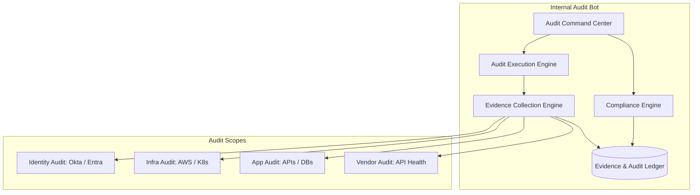

### 2. The "Living Evidence" Lifecycle
*How data becomes verifiable audit evidence.*
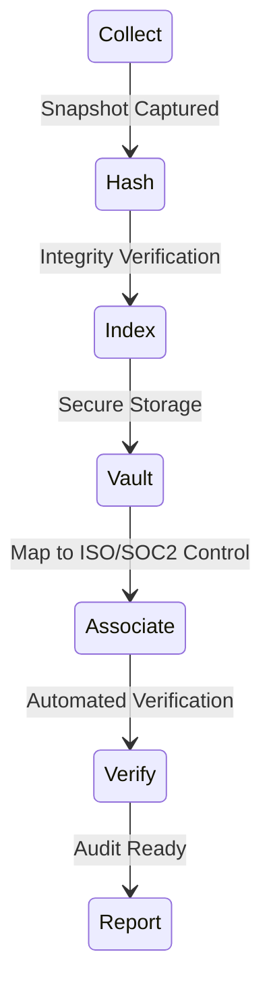

### 3. Continuous Control Monitoring Loop
*Ensuring controls never drift into failure.*
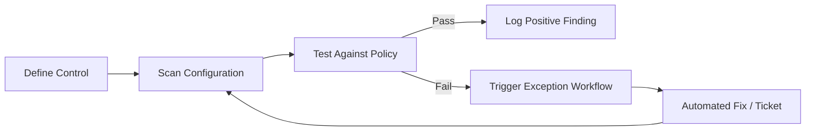

### 4. Risk-Based Audit Prioritization
*Allocating audit resources where they matter most.*
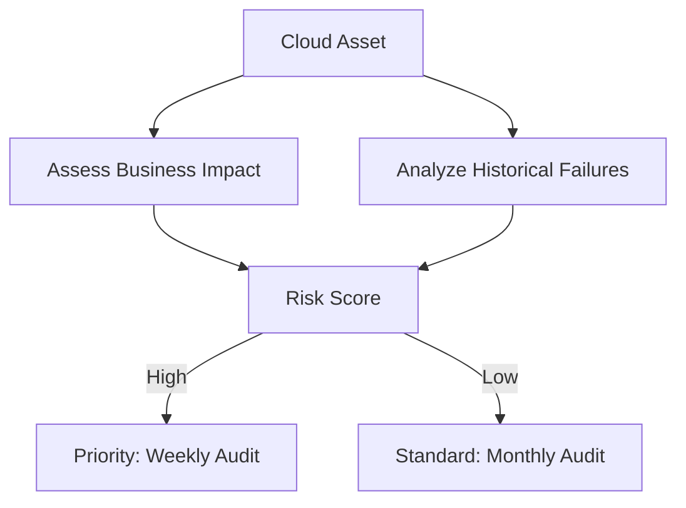

### 5. Multi-Cloud Evidence Correlation
*Mapping findings across different providers.*
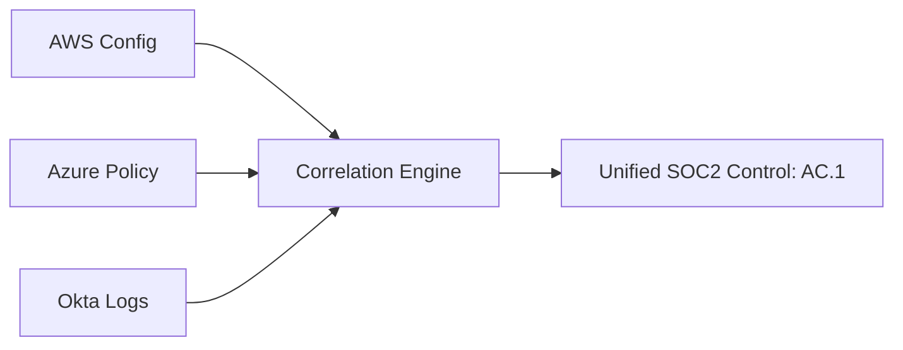

### 6. Identity Audit Workflow (MFA Verification)
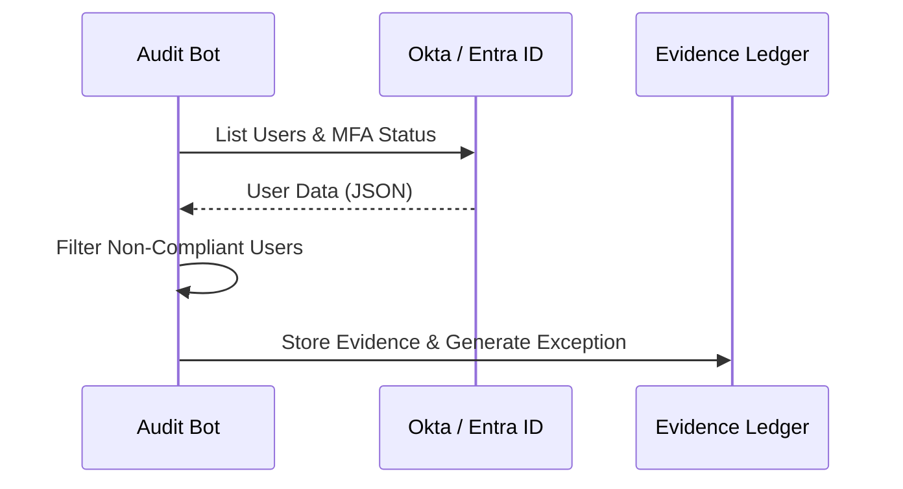

### 7. Evidence Integrity (Hashing) Pipeline
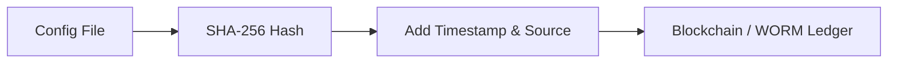

### 8. Exception Lifecycle Tracking
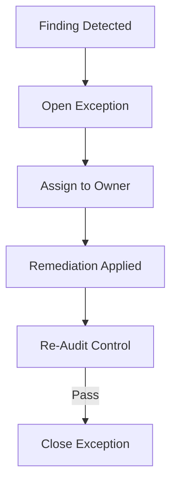

### 9. Compliance Mapping Model
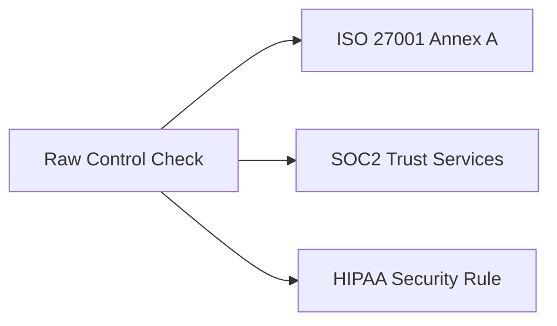

### 10. Audit Executive Scorecard Flow
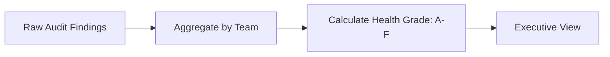

### 11. Continuous control monitoring
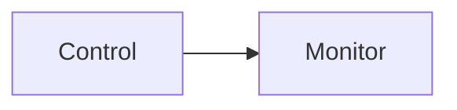

### 12. Evidence collection automation
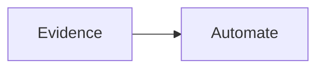

### 13. Audit workflow flow
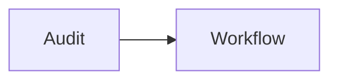

### 14. Risk-based audit planning
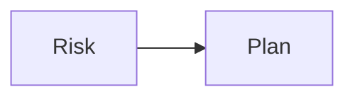

### 15. Compliance mapping flow
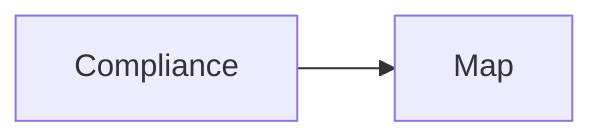

### 16. Control testing automation
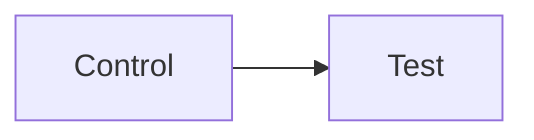

### 17. Audit trail logging
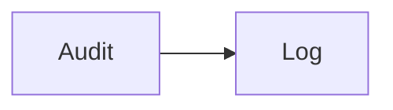

### 18. Exception tracking flow
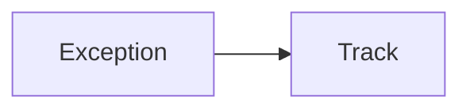

### 19. Remediation workflow
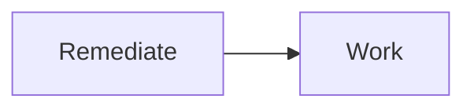

### 20. Policy validation flow
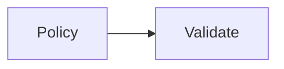

### 21. Data access audits
```mermaid
graph LR
    D[Data] --> A[Audit]
```

### 22. Identity audit flow
```mermaid
graph LR
    I[Identity] --> A[Audit]
```

### 23. Infrastructure audit flow
```mermaid
graph LR
    I[Infra] --> A[Audit]
```

### 24. Application audit flow
```mermaid
graph LR
    A[App] --> A[Audit]
```

### 25. Vendor risk audit
```mermaid
graph LR
    V[Vendor] --> R[Risk]
```

### 26. Reporting dashboard flow
```mermaid
graph LR
    R[Report] --> D[Dash]
```

### 27. Executive scorecard flow
```mermaid
graph LR
    S[Score] --> D[Dash]
```

### 28. Regulatory readiness flow
```mermaid
graph LR
    R[Ready] --> A[Audit]
```

### 29. Control monitoring pipeline
```mermaid
graph LR
    M[Monitor] --> P[Pipe]
```

### 30. Evidence ingestion flow
```mermaid
graph LR
    I[Ingest] --> E[Evidence]
```

### 31. Identity Audit: Entra ID Flow
```mermaid
graph LR
    E[Entra] --> A[Audit]
```

### 32. Identity Audit: Okta Flow
```mermaid
graph LR
    O[Okta] --> A[Audit]
```

### 33. Infrastructure Audit: AWS Flow
```mermaid
graph LR
    A[AWS] --> A[Audit]
```

### 34. Infrastructure Audit: K8s Flow
```mermaid
graph LR
    K[K8s] --> A[Audit]
```

### 35. Application Audit: API Flow
```mermaid
graph LR
    A[API] --> A[Audit]
```

### 36. Application Audit: DB Flow
```mermaid
graph LR
    D[DB] --> A[Audit]
```

### 37. Audit scheduling flow
```mermaid
graph LR
    S[Sched] --> A[Audit]
```

### 38. Notification pipeline
```mermaid
graph LR
    A[Audit] --> N[Notify]
```

### 39. Remediation tracking flow
```mermaid
graph LR
    R[Remed] --> T[Track]
```

### 40. Gap analysis model
```mermaid
graph LR
    G[Gap] --> A[Analyze]
```

### 41. ISO 27001 Control Flow
```mermaid
graph LR
    I[ISO] --> C[Control]
```

### 42. SOC2 Control Flow
```mermaid
graph LR
    S[SOC2] --> C[Control]
```

### 43. HIPAA Control Flow
```mermaid
graph LR
    H[HIPAA] --> C[Control]
```

### 44. GDPR Control Flow
```mermaid
graph LR
    G[GDPR] --> C[Control]
```

### 45. Access control policy flow
```mermaid
graph LR
    A[Access] --> P[Policy]
```

### 46. Data protection policy flow
```mermaid
graph LR
    D[Data] --> P[Policy]
```

### 47. Logging policy flow
```mermaid
graph LR
    L[Log] --> P[Policy]
```

### 48. Encryption policy flow
```mermaid
graph LR
    E[Encryption] --> P[Policy]
```

### 49. Evidence collection: Logs
```mermaid
graph LR
    L[Logs] --> E[Evidence]
```

### 50. Evidence collection: Configs
```mermaid
graph LR
    C[Configs] --> E[Evidence]
```

### 51. Evidence collection: Screenshots (Headless)
```mermaid
graph LR
    S[Screen] --> E[Evidence]
```

### 52. Evidence collection: Reports
```mermaid
graph LR
    R[Report] --> E[Evidence]
```

### 53. Audit report: PDF Generation
```mermaid
graph LR
    A[Audit] --> P[PDF]
```

### 54. Audit report: JSON Export
```mermaid
graph LR
    A[Audit] --> J[JSON]
```

### 55. Audit report: Dashboard View
```mermaid
graph LR
    A[Audit] --> D[Dash]
```

### 56. Audit report: Email Notification
```mermaid
graph LR
    A[Audit] --> E[Email]
```

### 57. Worker: Audit Execution
```mermaid
graph LR
    W[Worker] --> A[Audit]
```

### 58. Worker: Evidence Collection
```mermaid
graph LR
    W[Worker] --> E[Evidence]
```

### 59. Worker: Compliance Validation
```mermaid
graph LR
    W[Worker] --> C[Compliance]
```

### 60. Worker: Reporting
```mermaid
graph LR
    W[Worker] --> R[Report]
```

### 61. Service: ServiceNow Integration
```mermaid
graph LR
    I[Integrate] --> S[ServiceNow]
```

### 62. Service: Jira Integration
```mermaid
graph LR
    I[Integrate] --> J[Jira]
```

### 63. Service: Slack Notification
```mermaid
graph LR
    I[Integrate] --> S[Slack]
```

### 64. Service: Teams Notification
```mermaid
graph LR
    I[Integrate] --> T[Teams]
```

### 65. Audit Flow: Access Review
```mermaid
graph LR
    A[Access] --> R[Review]
```

### 66. Audit Flow: Firewall Check
```mermaid
graph LR
    F[Firewall] --> C[Check]
```

### 67. Audit Flow: Patching Status
```mermaid
graph LR
    P[Patch] --> S[Status]
```

### 68. Audit Flow: Backup Verification
```mermaid
graph LR
    B[Backup] --> V[Verify]
```

### 69. Audit Flow: Encryption Scan
```mermaid
graph LR
    E[Encrypt] --> S[Scan]
```

### 70. Audit Flow: User Onboarding Audit
```mermaid
graph LR
    U[User] --> O[Onboard] --> A[Audit]
```

### 71. Audit Flow: Offboarding Audit
```mermaid
graph LR
    U[User] --> O[Offboard] --> A[Audit]
```

### 72. Audit Flow: Change Management Audit
```mermaid
graph LR
    C[Change] --> A[Audit]
```

### 73. Audit Flow: Incident Audit
```mermaid
graph LR
    I[Incident] --> A[Audit]
```

### 74. Audit Flow: Vulnerability Audit
```mermaid
graph LR
    V[Vuln] --> A[Audit]
```

### 75. Audit lifecycle
```mermaid
stateDiagram-v2
    Plan --> Execute
    Execute --> Evaluate
    Evaluate --> Report
    Report --> FollowUp
```

### 76. Evidence vault architecture
```mermaid
graph TD
    S[Storage] --> H[Hash] --> I[Index]
```

### 77. Control failure detection flow
```mermaid
graph LR
    C[Control] --> F[Fail] --> A[Alert]
```

### 78. Compliance readiness score
```mermaid
graph LR
    C[Compliance] --> R[Ready] --> S[Score]
```

### 79. Audit correlation engine
```mermaid
graph LR
    C[Correlation] --> E[Engine]
```

### 80. Value realization model
```mermaid
graph LR
    V[Value] --> R[Realize]
```

---

## 🛠️ Technical Stack & Implementation

### Audit & Evidence Engine
- **Processing**: Python 3.11+ / FastAPI
- **Automation**: Scriped evidence collection (AWS Boto3, Azure SDK, Okta API).
- **Validation**: OPA (Open Policy Agent) for control verification.

### Frontend (Audit Command Center)
- **Framework**: React 18 / Vite
- **Visuals**: Recharts (Compliance Trends, Risk Heatmaps).
- **Theme**: Slate, Amber, and Rose (Professional Audit Aesthetics).

### Infrastructure
- **IaC**: Terraform (Managed RDS, Redis, EKS clusters).
- **Storage**: Evidence vault with WORM (Write Once Read Many) characteristics.

---

## 🚀 Deployment Guide

### Local Development
```bash
# Clone the repository
git clone https://github.com/devopstrio/internal-audit-bot.git
cd internal-audit-bot

# Setup environment
cp .env.example .env

# Launch services
make up
```
Access the Audit Command Center at `http://localhost:3000`.

---

## 📜 License
Distributed under the MIT License. See `LICENSE` for more information.
