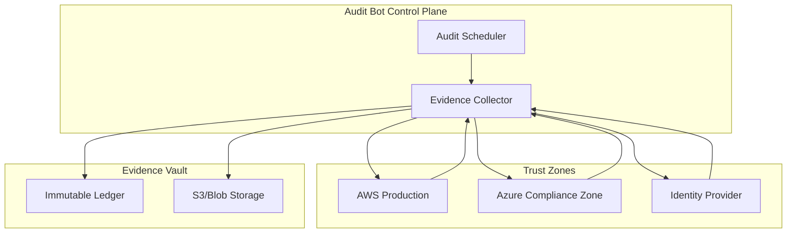
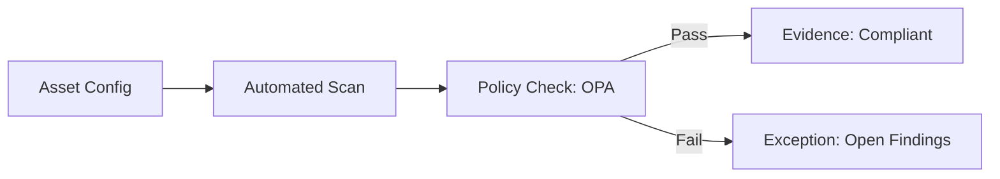
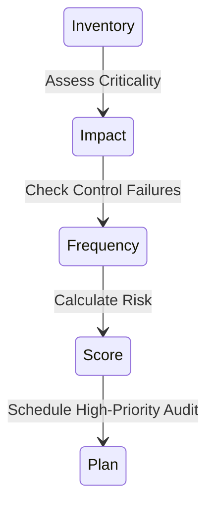

# Architecture & Audit Diagrams

## 11. Multi-Cloud Evidence Collection Topology (Detailed)
*How the bot orchestrates data collection across disparate trust zones.*

## 13. Continuous Control Verification Loop

## 20. Risk-Based Audit Selection Model

