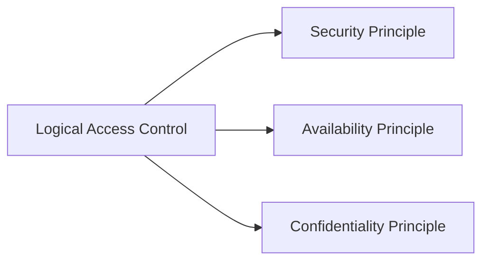
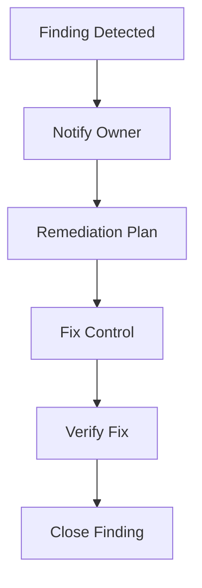
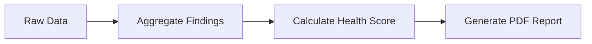

# Compliance & Control Diagrams

## 31. SOC2 Trust Services Mapping

```mermaid
graph LR
    Control[Logical Access Control] --> SOC2_S[Security Principle]
    Control --> SOC2_A[Availability Principle]
    Control --> SOC2_C[Confidentiality Principle]
```

## 34. Exception Management Workflow

```mermaid
graph TD
    Find[Finding Detected] --> Notify[Notify Owner]
    Notify --> Plan[Remediation Plan]
    Plan --> Execute[Fix Control]
    Execute --> ReAudit[Verify Fix]
    ReAudit --> Close[Close Finding]
```

## 40. Audit Reporting Pipeline

```mermaid
graph LR
    Raw[Raw Data] --> Agg[Aggregate Findings]
    Agg --> Grade[Calculate Health Score]
    Grade --> Doc[Generate PDF Report]
```
